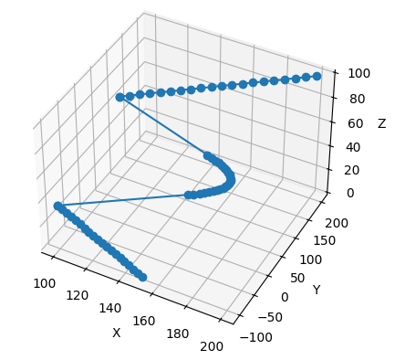
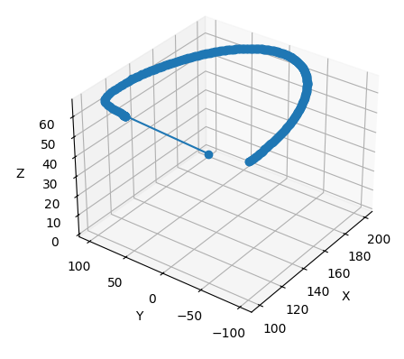
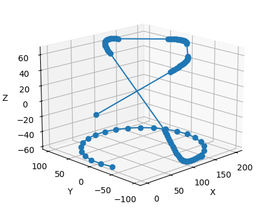
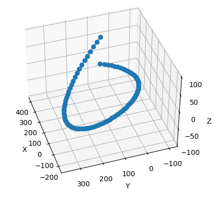
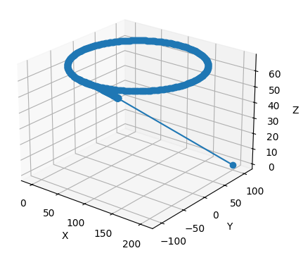

<p align="center"></img></p>

## Содержание
<ul>
  <li><a href='#overview'>Обзор</a></li>
  <li><a href='#accounts'>Аккаунты</a></li>
  <ul>
    <li><a href='#roles'>Роли</a>
    <ul>
        <li><a href='#user'>User</a></li>
        <li><a href='#administrator'>Administrator</a></li>
        <li><a href='#SuperAdmin'>SuperAdmin</a></li>
    </ul>
    </li>
    <li><a href='#AuthSym'>Симуляция авторизации</a></li>
    <li><a href='#SecCerts'>Сертификаты безопасности</a></li>
  </ul>
  <li><a href='#auth'>Аутентификация</a></li>
  <li><a href='#types'>Типы данных</a>
  <ul>
    <li><a href='#XYZPos'>XYZPos</a></li>
    <li><a href='#AnglePos'>AnglePos</a></li>
    <li><a href='#Spline'>Spline</a></li>
    <li><a href='#RobotData'>RobotData</a></li>
    <li><a href='#ReturnData'>ReturnData</a></li>
  </ul>
  </li>
  <li><a href='#vis'>Визуализация</a></li>
  <li><a href='#move'>Перемещения</a>
  <ul>
    <li><a href='#lin2lin'>LIN => LIN</a></li>
    <li><a href='#circ2lin'>CIRC => LIN</a></li>
    <li><a href='#lin2n'>Multiply LIN</a></li>
    <li><a href='#spline'>Spline</a></li>
    <li><a href='#circArc'>CIRC (arc) => LIN</a></li>
  </ul>
  </li>
  <li><a href='#comands'>Команды</a>
  <ul>
    <li><a href='#__robot'>__robot</a></li>
    <li><a href='#__tools'>__tools</a></li>
    <li><a href='#__user'>User</a></li>
    <li><a href='#__admin'>Admin</a></li>
    <li><a href='#__SuperAdmin'>SuperAdmin</a></li>
  </ul>
  </li>
  <li><a href='#help'>Помощь в разработке</a></li>
  <li><a href='#links'>Ссылки</a></li>
</ul>

<h2 id='overview'>Обзор</h2>

Библиотека для управления и администрирования промышленных роботизированных систем с использованием [`URSystem API`](https://github.com/MrBrain-YT/URSystem/blob/main/doc/API.md). Содержит в себе элементы для построения траекторий с использованием синтаксиса похожего на `Kuka Robotics Language`

<h2 id='accounts'>Аккаунты</h2>

- <h2 id='roles'>Роли</h2>

    Библиотека предоставляет доступ к 3 ролям в системе:
    - <h3 id='user'>User</h3>

        User может работать только с роботами и инструментами:

        ```python
        system = Auth(server_token="15244dfbf0c9bd8378127e990c48e5a68b8c5a5786f34704bc528c9d91dbc84a",
                ip="localhost", port=5000).user("user","12345").system(host="localhost", port=5000)
        system.ptp(robot, pos)
        ```

        ---

    - <h3 id='administrator'>Administrator</h3>

        Administrator уже предоставлены права для работы напрямую с системой, но они не являются максимальными:

        ```python
        system = Auth(server_token="15244dfbf0c9bd8378127e990c48e5a68b8c5a5786f34704bc528c9d91dbc84a",
                ip="localhost", port=5000).admin("Admin","12345").system(host="localhost", port=5000)
        system.delete_robot(robot_name="First")
        ```

        ---

    - <h3 id='SuperAdmin'>SuperAdmin</h3>

        SuperAdmin имеет все права для работы в системе. Он может удалять как пользователей, так и администраторов, изменять пароли и т.д.:

        ```python
        system = Auth(server_token="15244dfbf0c9bd8378127e990c48e5a68b8c5a5786f34704bc528c9d91dbc84a",
                ip="localhost", port=5000).SuperAdmin("SuperAdmin","12345").system(host="localhost", port=5000)
        system.delete_user(name="Jon")
        ```

    Каждая роль более высокого уровня может использовать команды ролей более низкого уровня. То есть администратор может быть также пользователем, а супер администратор может быть как администратором, так и пользователем соответственно.

- <h2 id='AuthSym'>Симуляция авторизации</h2>
    Симуляция авторизации может понадобиться в тех случаях когда отправка комманд на оборудование не обязательна, например просмотр результата функции постоения траекторий перемещения роботов.

    - ### Пример
        ```python
        import auth
        import __robot

        __robot.TRAJECTORY_SEND_SWITCH = False

        system = auth.Auth("localhost", 5000, "15244dfbf0c9bd8378127e990c48e5a68b8c5a5786f34704bc528c9d91dbc84a", symulate=True)\
            .super_admin("SuperAdmin", "12345").system("localhost", 5000)
        ```

        - `__robot.TRAJECTORY_SEND_SWITCH = False` - отключение отправки данных на сервер в модуле `__robot`
        - `symulate=True` -  не обязательный параметр для получения роли и токена (когда значение `True`, возвращаеться роль `SuperAdmin`, а токен `123456789*qwerty`)

- <h2 id='SecCerts'>Сертификаты безопасности</h2>

    Для отправки запросов необходимо установить SSL-сертификат, выданный вашей компанией, или стандартный сертификат URSystem в `доверенные корневые центры сертификации (Windows)`.

<h1 id='auth'>Аутентификация</h1>

Сначала вы получаете свою роль и токен с сервера:

```python
import auth

accounts_server = auth.Auth(server_token="15244dfbf0c9bd8378127e990c48e5a68b8c5a5786f34704bc528c9d91dbc84a",
        ip="localhost", port=5000)
```

`server_token` — это набор символов, подтверждающий вашу принадлежность к определённой компании. Если вы использовали правильный токен, сервер обработает ваш запрос и проверит логин и пароль (в момент инициализации класса Auth никаких проверок не происходит, только сохранение данных).

Теперь, мы можем получить токен и роль с помощью следующей команды:

```python
account = accounts_server.user(name="user", password="12345")
```

Теперь, имея учётную запись, мы можем подключиться к системе:

```python
system = account.system(host="localhost", port=5000)
```

А затем, будучи подключённым к системе, можно использовать команды для работы. Вот пример кода:

```python
system.ptp(robot, pos)
```

<h1 id='types'>Типы данных</h1>

-  <h3 id='XYZPos'>XYZPos</h3>

    Позиция в декартовой системе координат
    ```python
    from data_types import XYZPos

    XYZPos().from_list([201,150,100])
    ``` 

-  <h3 id='AnglePos'>AnglePos</h3>

    Позиция робота указанная в углах для каждой оси
    ```python
    from data_types import AnglePos

    AnglePos().from_list([200,40,0,150]) # 4 Axis
    ``` 

-  <h3 id='Spline'>Spline</h3>

    Траетория строящаяся по 1 из 2 выбранных алгоритмов
    - Сплайн Катмулл-Рома
    - Кубический сплайн (`Scypy version`)

    Стандарстным способом можно использовать только кубический сплайн
    
    ```python
    from data_types import XYZPos, Spline

    spl = Spline(robot_data=robot, system=system, num_points=10)
    p0 = XYZPos().from_list([201,150,100])
    p1 = XYZPos().from_list([200,-50,100])
    p2 = XYZPos().from_list([-200,310,100])
    p3 = XYZPos().from_list([400,50,100])
    spl.add_point(p0, p1, p2, p3)
    spl.start_move()
    ``` 

-  <h3 id='RobotData'>RobotData</h3>

    Дата класс использующийся для хранения данных о роботе
    ```python
    from data_types import RobotData

    robot = RobotData(name="First", code="654123")
    ``` 


-  <h3 id='ReturnData'>ReturnData</h3>

    Дата класс использующийся для стандартизации вывода использования функций
    ```python
    lin1 = system.lin(robot, p1, start=p0)

    # lin1 is instance ReturnData() class
    ```

<h1 id='vis'>Визуализация</h1>

Визуализация траекторий происходит при помощи библиотеке `matplotlib` и `plotly` и работает только с XYZpos точками. Особенность использования matplotlib в том что он останавливает выполение кода пока окно с визуализацией не будет закрыто. Чтобы этого избежать можно использовать библиотеку plotly.

### Пример

```python
from data_types import XYZPos, Spline
from utils.vizualizer import Vizualization

spl = Spline(robot_data=robot, system=system, num_points=10)
p0 = XYZPos().from_list([201,150,100])
p1 = XYZPos().from_list([200,-50,100])
p2 = XYZPos().from_list([-200,310,100])
p3 = XYZPos().from_list([400,50,100])
spl.add_point(p0, p1, p2, p3)
return_data = spl.start_move()
Vizualization(trajectory=return_data.trjectory).show_mathplotlib_trajectory_plot()
# or 
Vizualization(trajectory=return_data.trjectory).show_plotly_trajectory_plot()
```

<h1 id='move'>Перемещения</h1>

</img>
<h3 id='lin2lin'>LIN => LIN</h3>
Линейное перемещение со сглаживанием в другое линейное перемещение

```python
p2 = XYZPos().from_list([200, 0, 67.117])
p2.smooth_endPoint = p3
p2.smooth_distance = 50

system.lin(robot, p2, 20)
```
Сглаживание точки происходит благодяря указанию следующей точки в параметр `smooth_endPoint`, дистанция сглаживания измеряеться от точки сглаживаемого угла.
<br>
<br>


</img>

<h3 id='circ2lin'>&nbsp;&nbsp;CIRC => LIN</h3>
&nbsp;&nbsp;Дуговое перемещение со сглаживанием в линейное перемещение

```python
p3 = XYZPos().from_list([200, 0, 67.117])
p3.smooth_endPoint = p4
p3.smooth_distance = 50

system.circ(robot, [p1,p2,p3], 300)
```
&nbsp;Сглаживание точки происходит благодяря указанию следующей точки в параметр `smooth_endPoint` 3 точки дуги , дистанция сглаживания измеряеться от точки сглаживаемого угла.
<br>
<br>

</img>
<h3 id='lin2n'>LIN => LIN => LIN => LIN => CIRC</h3>

Многократное сглаживаемое линейное перемещение с итоговым сглаживанием в дугу по градусам `p7.circ_angle = 300`
<br>

```python
p1.smooth_endPoint = p2; p1.smooth_distance = 30
p2.smooth_endPoint = p3; p2.smooth_distance = 30
p3.smooth_endPoint = p4; p3.smooth_distance = 30
p7.circ_angle = 300
p4.smooth_endPoint = [p5, p6, p7]
```
<br>
<br>


</img>
<h3 id='spline'>&nbsp;SPLINE</h3>

&nbsp;Перемещение по сплайновой траектории. Построение траектории в данном примере происходит при вызове `spl.start_move()`

```python
spl = Spline(robot_data=robot, system=system)
p0 = XYZPos().from_list([0,150,100])
p1 = XYZPos().from_list([200,-50,-100])
p2 = XYZPos().from_list([-200,310,0])
p3 = XYZPos().from_list([400,50,50])
spl.add_point(p0, p1, p2, p3)
trajectory = spl.start_move()
```
<br>

</img>
<h3 id='circArc'>CIRC (arc) => LIN</h3>
Дуговое перемещение с указанием угла со сглаживанием в линейное перемещение. Минимальный угол <b>18°</b>

```python
p1 = XYZPos().from_list([100, -100, 67.117])
p2 = XYZPos().from_list([200, 0, 67.117])
p3 = XYZPos().from_list([100, 100, 67.117])
p4 = XYZPos().from_list([200, 100, 0])
p3.smooth_endPoint = p4
p3.smooth_distance = 30
trajectory = system.circ(robot, [p1,p2,p3], 300, arc_angle=3600).trjectory
```
Сглаживание точки происходит благодяря указанию следующей точки в параметр `smooth_endPoint`, дистанция сглаживания измеряеться от точки сглаживаемого угла.

<h1 id='comands'>Команды</h1>

На основе модулей `__robot` и `__tools` строится модуль `__user`
- <h3 id='__robot'>__robot</h3>

    - `_speed_multiplier` - Множитель скорости для списка скоростей осей

        ```python
        def _speed_multiplier(self, speed_list:list, multiplier:float):
        ```
    - `get_angles_count` - Получение количества осей робота

        ```python
        def get_angles_count(self, robot_data:RobotData) -> int:
        ```
    - `check_emergency` - Получение состояния аварийного останова робота

        ```python
        def check_emergency(self, robot_data:RobotData) -> bool:
        ```
    - `set_robot_position` - Установка позиции робота (для пользовательских траекторий)

        ```python
        def set_robot_position(self, robot_data:RobotData, angles:Union[AnglePos, list[AnglePos]], is_multi_point:bool=False, last_point_position:Union[XYZPos, None]=None) -> dict:

        ```
    - `set_robot_speed` - Установка скорости робота (для пользовательских траекторий). При multi_point позиции каждая скорость по индексу присваиваеться целевой точке с тем же индексом.

        ```python
        def set_robot_speed(self, robot_data:RobotData, angles_speed:Union[AnglePos, list[AnglePos]], is_multi_point:bool=False) -> dict:
        ```
    - `move_xyz` - PTP перемещение по координатам

        ```python
        def move_xyz(self, robot_data:RobotData, position:XYZPos) -> dict:
        ```
    - `xyz_to_angle` - Перевод координат в углы

        ```python
        def xyz_to_angle(self, robot_data:RobotData, positions:list[XYZPos], is_multi_point:bool=False) -> Union[AnglePos, list[AnglePos]]:
        ```
    - `angle_to_xyz` - Перевод углов в координаты

        ```python
        def angle_to_xyz(self, robot_data:RobotData, angles:list[AnglePos], is_multi_point:bool=False) -> dict:
        ```
    - `calculate_speed` - Высчитывает скорость для PTP перемещения

        ```python
        @staticmethod
        def calculate_speed(start_angles:AnglePos, end_angles:AnglePos, steps:int) -> list:
        ```
    - `ptp` - Point to point перемещение (определяеться такой скоростью осей, чтобы при приезде в конечную точку все оси остановились одновременно)

        ```python
        def ptp(self, robot_data:RobotData, angles:AnglePos, step_count:int=100) -> ReturnData:
        ```
    - `generate_line_points` - Создаёт линию из множества точек `multipoint_position`, тем самым не давая роботу сойти с траектории. При движении робот прроезжает множество коротких PTP траекторий.

        ```python
        @staticmethod
        def generate_line_points(start:XYZPos, end:XYZPos, num_points:int):
        ```
    - `lin` - Линейное перемещение (Количество точек на линии регулируется параметром `num_points`)

        ```python
        def lin(self, robot_data:RobotData, end_point:XYZPos, num_points:int=25, lin_step_count:int=25, speed_multiplier:int=1, start:XYZPos=None) -> ReturnData:
        ```
    - `circ` - Перемещение по дуге из 3 точек

        ```python
        def circ(self, robot_data:RobotData, points_xyz:list[XYZPos], count_points:int, arc_angle:float=None, speed_multiplier:float=1, lin_step_count:int=10) -> ReturnData:
        ```
    - `get_log` - Получение логов робота

        ```python
        def get_log(self, robot_data:RobotData) -> dict:
        ```
    - `get_last_log` - Получение посленего лога робота

        ```python
        def get_last_log(self, robot_data:RobotData) -> dict:
        ```
    - `debug` - Добавление в лог робота DEBUG сообщение

        ```python
        def debug(self, robot_data:RobotData, text:str) -> dict:
        ```
    - `set_program` - Установка програмы автоматики (Тип отправляемой программы `hex строка`)

        ```python
        def set_program(self, robot_data:RobotData, program:str) -> dict:
        ```
    - `delete_program` - Удаление программы (Приводит к её завершению)

        ```python
        def delete_program(self, robot_data:RobotData) -> dict:
        ```

- <h3 id='__tools'>__tools</h3>

    - `get_tool_info` - Получение данных инструмента

        ```python
        def get_tool_info(self, id:str) -> dict:
        ```

    - `set_tool_info` - Установка данных инструмента

        ```python
        def set_tool_info(self, id:str, config:Any) -> dict:
        ```

- <h3 id='__user'>User</h3>

    `SetEmergency` - Установить значение виртуального аварийновго останова робота

    ```python
    def set_emergency(self, robot_data:RobotData, state:bool) -> dict:
    ```

- <h3 id='__admin'>Admin</h3>

    `add_kinematics` - Загрузка файлов кинематики на сервер

    ```python
    def add_kinematics(self, path:str, file_name:str) -> dict:
    ```
    `bind_kinematics` - Привязка кинематики к роботу

    ```python
    def bind_kinematics(self, robot_data:RobotData, folder_name:str) -> dict:
    ```
    `add_tool` - Добавление инструмента

    ```python
    def add_tool(self, id:str) -> dict:
    ```
    `add_robot` - Добавление робота

    ```python
    def add_robot(self, robot_data:RobotData, angle_count:int, kinematics:str="None") -> dict:
    ```
    `set_robot_home` - Установить значение домашней позиции робота

    ```python
    def set_robot_home(self, robot_data:RobotData, angles:list) -> dict:
    ```
    `delete_tool` - Удалить инструмент

    ```python
    def delete_tool(self, id) -> dict:
    ```
    `delete_robot` - Удалить робота

    ```python
    def delete_robot(self, robot_data:RobotData) -> dict:
    ```
    `add_user` - Добавить пользователя (только с ролью user)

    ```python
    def add_user(self, name:str, password:str) -> dict:
    ```
    `get_robots` - Получение конфигурации всех роботов (параметр `ProgramToken` не передаётся)

    ```python
    def get_robots(self) -> dict:
    ```
    `get_robot` - Получение конфигурации робота (параметр `ProgramToken` не передаётся)

    ```python
    def get_robot(self, robot_data:RobotData) -> dict:
    ```
    `get_system_log` - Получение системного лога

    ```python
    def get_system_log(self) -> dict:
    ```
    `get_system_last_log` - Получение последнего системного лога

    ```python
    def get_system_last_log(self) -> dict:
    ```

- <h3 id='__SuperAdmin'>SuperAdmin</h3>

    `delete_user` - Удалить пользователя

    ```python
    def delete_user(self, name:str) -> dict:
    ```
    `add_user` - Добавить пользователя (с любой ролью, кроме `System`)

    ```python
    def add_user(self, name:str, password:str, role:str) -> dict:
    ```
    `get_user_accounts` - Получение информации об аккаунте (аккаунты с ролями `System` и `SuperAdmin` не передаются)

    ```python
    def get_user_accounts(self) -> str:
    ```
    `change_password` - Изменить пароль аккаунта

    ```python
    def change_password(self, name:str, password:str) -> dict:
    ```
    `get_account_token` - Получение токена аккаунта

    ```python
    def get_account_token(self, name:str, password:str) -> dict:
    ```
    `change_token` - Изменение токена аккаунта

    ```python
    def change_token(self, name:str, password:str) -> dict:
    ```
    `export_cache` - Экспорт конфигурации сервера (Роботов, инструментов и фреймов)

    ```python
    def export_cache(self) -> dict:
    ```
    `import_cache` - Импорт конфигурации сервера

    ```python
    def import_cache(self, robots:dict, tools:dict, frames:dict) -> dict:
    ```


<h1 id='help'>Помощь в разработке</h1>

Если вы заметили не работающий функционал или какие либо другие ошибки, пожалуйста создайте `Issues` на github с описанием проблемы. Вы очень сильно поможете с продвижением в разработке. 
Также вы можете учавствовать в разработке библиотеки и самой системы.

<h1 id='links'>Ссылки</h1>

- [`URSystem`](https://github.com/MrBrain-YT/URSystem)