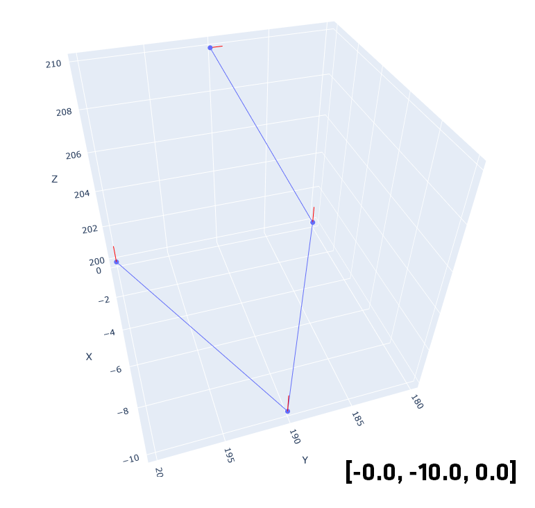
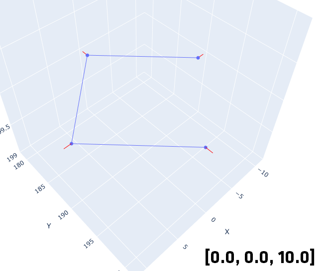

# Последние изменения
## 21.05.2025
- Добавлен функционал для каллибровки инструмента

    </img>
    </img>
- Добавлен функционал для каллибровки базы
- Добавлена возможность выбора системы координат при отправке траектории на робота
- Добавлен функционал для управления базами
## 30.04.2025
- Обновлено использование API URSystem для работы с логами
## 27.04.2025
- Добавлена поддержка триггеров [подробнее здесь](../README.md) во вкладке 
`Триггеры`
- Добавлена утилита для обработки триггеров
## 19.04.2025
- Добалвлена поддержка перемещений по драектории с использованием углов ABC по стандарту (`ISO 9787:2013`)
- Добавлена поддержка углов ABC в визуализацию траекторий. Пример:

</img>
