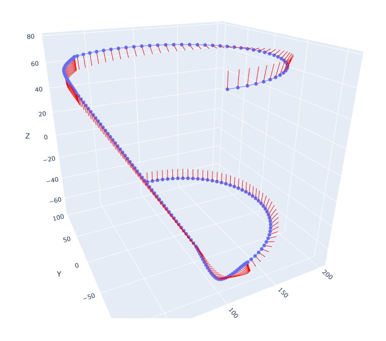

# Последние изменения
## 27.04.2025
- Добалвлена поддержка триггеров [подробнее здесь](../README.md) во вкладке 
`Триггеры`
- Добавлена утилита для обработки триггеров
## 19.04.2025
- Добалвлена поддержка перемещений по драектории с использованием углов ABC по стандарту (`ISO 9787:2013`)
- Добавлена поддержка углов ABC в визуализацию траекторий. Пример:

</img>
